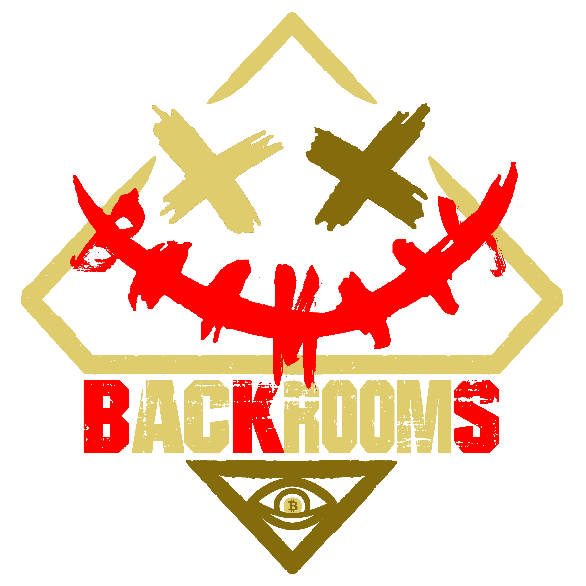

# BACKROOMS

### Project Website

Website: http://backrooms.space

### Primary Contact

Twitter: https://twitter.com/BACKROOMS_BKS

Discord: https://discord.gg/backroomsbks

Email: BackroomsFund@gmail.com

Github: https://github.com/BackRooms-Foundation

## Project Description 

Built by UE5, driven by Ai, a web3 game with Backrooms theme.

Our advantage:
* Top game development team (UE5);
* World-renowned IP (backrooms 10 billion plays);
*Gather interdisciplinary and multi-field compound talents;
* The operation team is the operating company of well-known 4A companies and the world's top entertainment companies

## Eligibility

- Is this project deployed on Sui Devnet or Testnet or otherwise integrated with Sui?
    - [x] Yes
    - [ ] No
- Will, at least, one of your team members be able to present your team project in-person at the Sui Demo Day @ HK on April 16th, 2023?
    - [x] Yes
    - [ ] No