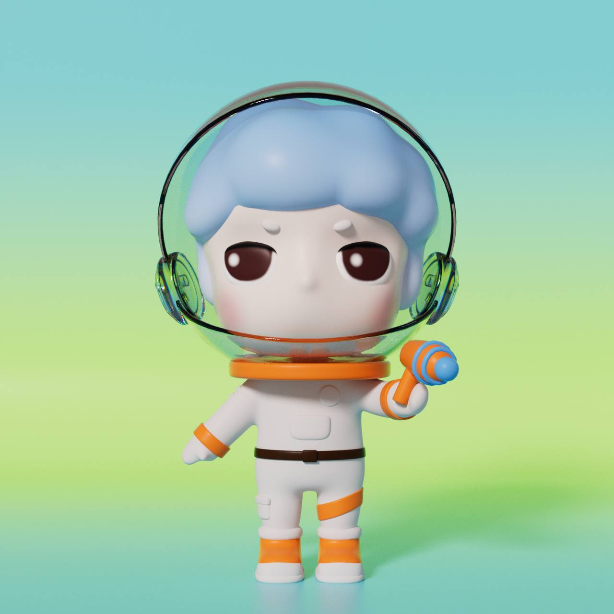

# Sui Demo Day @ HK Registration Template

## Basic Information

### Project Name or Logo

MiniMars

### Project Website

https://twitter.com/Minimars_Sui 

### Primary Contact

Telegram: @hoboberri

### GitHub Repository (Optional)

Enter the project's GitHub repo URL here, optional if not open source

## Project Description 

MiniMars is a brand on Sui and by the Community. We’ll have 3388 MiniMars launched as the first generation to start the Mars program and also it’s a tribute to NASA. MiniMars cafe plan has been started. Now we have the first MiniMars cafe and there will be more since we have crowdfunding rights for holders. Also we’ll launch the next generation with other projects and brands. 

[Project Pitchdeck](https://docs.google.com/presentation/d/1SGeH19LZ7XXU5qFV0tcJ1TrnPi3jYGew/edit?usp=share_link&ouid=100963468120336818645&rtpof=true&sd=true)

## Eligibility

- Is this project deployed on Sui Devnet or Testnet or otherwise integrated with Sui?
    - [x] Yes
    - [ ] No
- Will, at least, one of your team members be able to present your team project in-person at the Sui Demo Day @ HK on April 16th, 2023?
    - [x] Yes
    - [ ] No