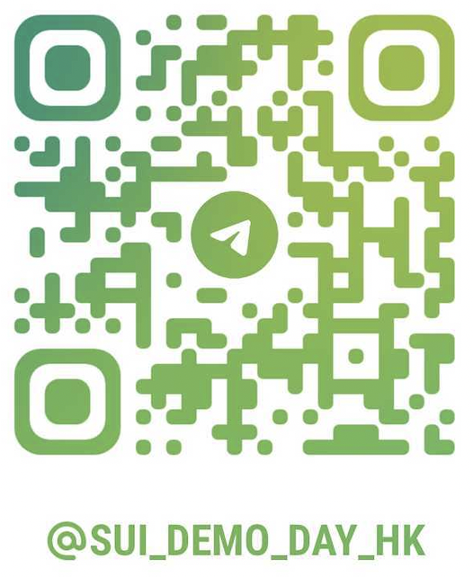

# Sui Demo Day @ Hong Kong

## Key Information

- **Hong Kong Builder House**: April 14th - April 16th, 2023
- **Demo Day**: April 16th, Afternoon
- **Address**: 
- **Builder House Registration Link**:

_If you are planning to participate in the Sui Demo Day, please indicate that when you register for the HK Builder House._

## Contest Eligibility

- The project must be deployed to Sui Devnet or Testnet 
- At least one of the project's team members must be able to attend Sui Demo Day in-person to present the project
- A member of the team must pass KYC to receive prizes
- For detailed legal terms and conditions of the Sui Demo Day contest, please check [here](placeholder)

## Primary Tracks

- **DeFi and Payments**
- **NFT and Gaming**
- **Infrastructure and Dev Tooling**
- **DID, Governance and Social**

## Registration - March 19th to April 15th

1. Fill out this registration template form, and change the file name to your project or team name, so that the file name would be of the form `[project name].md`. 

2. Open a PR to submit the filled out registration template under the folder of the appropriate primary track that your project will be competing in. If your project can fall under multiple tracks, please pick one that fits best. 

*Note that a given project can only register under one track.*

3. The submitted project information above will be public and used by in the voting and judging process, as well as other parts of the contest

4. Join the Sui Demo Day @ HK [telegram group](https://t.me/sui_demo_day_hk) for coordination of the contest.

### Individual Participants 

For individual participants looking to form or join a team, please join the relevant channel in the event Telegram super group to look for a team or other teammates. Once the project team is confirmed, please register using the team registration flow. 

## Voting Period - April 14th to April 15th

- Attendents of the HK builder house and other trusted community members can begin voting on submitted projects
- The voting results will be used to select for Audience Favorite prizes
- The results can also be used to select for projects to advance to the next round for categories that are oversubscribed. 
- Voting structure: leaning toward ranked preference voting by category
- People who vote on the competition will be eligible for special Sui swag

### Demo Day - April 16th

Will invite and select a panel of judges who can attend the demo day in person, from Sui Foundation, Mysten, partner organizations, VC’s, institutions, etc. 
It’s preferable for external judges to outnumber Sui/Mysten judges to maintain neutrality 
The actual demo period will be 2-4 hours (with ample breaks in between) depending on how many entries we get
Let’s use 3 hours for example
8 minutes per project, ~25 projects
We can adjust the total time period and time per project depending on number of teams toward the end of registration period
Live scoring is done on a number of criteria (drop lowest and highest scores and compute total scores, etc.)
Determine category winners based on score tallies
Announce winners (pending KYC)  on the same day before the end of the builder house

## Prize Structure

## Developer Resources

TODO
