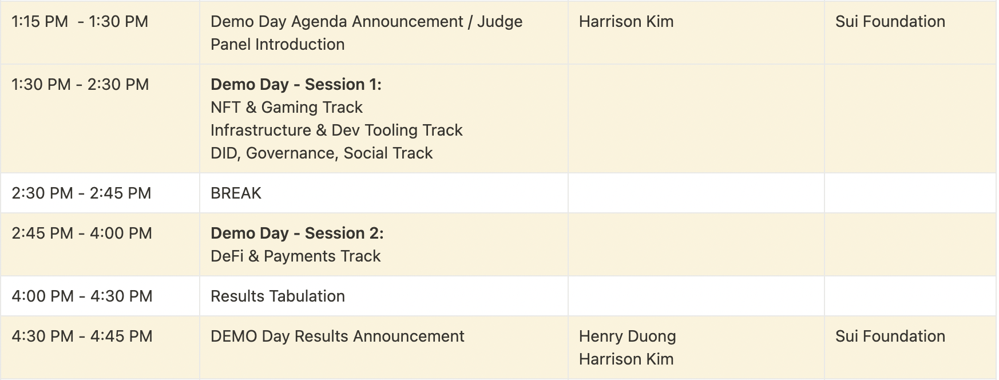

    

# Sui Demo Day @ Hong Kong

## Overview

The Sui Foundation is hosting its first Sui Demo Day in Hong Kong, on April 16th, 2023, as a part of the Hong Kong Sui Builder House event.  

Sui Foundation is an independent, non-profit organization dedicated to promoting the adoption of Sui Network and its associated technology stack, such as the Sui Move smart contract language. Sui Foundation believes openness and competition will drive the most innovative and disruptive products to be built on Sui Network; Sui Demo Day aims to foster those spirits.  

Sui Demo Day is open to both new and existing projects and developers within the Sui ecosystem. The event aims to provide an open platform for projects, teams and individual developers on Sui to showcase what they are creating on Sui Network.

## Key Information

- **Sui Hong Kong Builder House**: April 14th - April 16th, 2023
- **Sui Demo Day**: April 16th, 2023
- **Address**: [Eaton Club](https://goo.gl/maps/JM3iJA8EYWfNYj8bA), 5/F, Champion Tower, 3 Garden Rd, Central, Central, Hong Kong
- **[Builder House Registration Page](https://lu.ma/sui.hongkong)**

    _If you are planning to participate in the Sui Demo Day, please indicate that when you register for the HK Builder House._
- **Presentation Language**: Presentations can be in either Cantonese, English or Mandarin. Conference interpreters will be available during the Demo Day session
- **New Registration Cutoff**: April 11th, 11 PM HKT
- [**Demo Day Shortlist**](https://docs.google.com/spreadsheets/d/1cmnXwqVPCegaYAubdhNANbsFASCIiSGrAzPrSDIEnvc/edit?usp=sharing)
- [**Sui Demo Day Telegram Group**](https://t.me/sui_demo_day_hk)

    

## Contest Eligibility

- The project must be deployed to Sui Devnet or Testnet, or otherwise integrated with Sui
- Both new and existing Sui projects are welcome to participate
- At least one of the project's team members must be able to attend Sui Demo Day in-person to present the project
- A member of the team must pass KYC to receive any prizes
- For detailed terms and conditions of the Sui Demo Day contest, please check [here](./TERMS.md)

## Primary Tracks

- **DeFi and Payments**
- **NFT and Gaming**
- **Infrastructure and Dev Tooling**
- **DID, Governance and Social**

## Registration 

1. Join the [Sui Demo Day @ HK Telegram group](https://t.me/sui_demo_day_hk) for coordination of the contest and related communication and updates

2. Fork this current repository and create a copy of the [Registration Template Form](./REGISTRATION_TEMPLATE.md) under the sub-folder corresponding to the primary track that your project will be competing in. If your project can be categorized under multiple tracks, please pick one that fits best. 

    _Note: a given project can only register under one track._

3. Fill out the information on the [Registration Template Form](./REGISTRATION_TEMPLATE.md), and change the file name to your project name, so that the file name is of the form `[your project name].md`. 

4. Open a pull request from your fork to the `main` branch of this repository to submit the filled out registration template form. Registration PR's will be merged regularly and once merged, the project will be considered registered for the Demo Day event. 

## Contest Structure

### Registration Period - March 15th to April 11th, 9 PM HKT

1. Register for the Sui Demo Day by following the steps described above

2. The submitted project information above will be public and used by in the audience voting and panel judging process.

4. Registered teams are able to update their submitted project information up until April 15th, 23:59pm by submitting additional PR's to this repo.

5. Join the [Sui Demo Day @ HK Telegram group](https://t.me/sui_demo_day_hk) for coordination of the contest.

    _Note: For individuals interested in forming or joining a team, please join the `Team Forming` channel in the Telegram super group above to look for a team or other teammates. Once the project team is confirmed, please register using the team registration flow._

### Shortlisting - April 10th

Registered projects will be pre-filtered for eligibility requirements and shortlisted on April 10th to give teams a better idea of whether they will be eligible to demo.

If your project is registered but not on the shortlist, it's likely the project did not meet some of the eligibility requirements, with the main one being the project has to be materially integrated with Sui devnet or testnet. If your project has had recent updates, or you believe it was in error to not be shortlisted, please contact one of the organizers through the [**Sui Demo Day Telegram Group**](https://t.me/sui_demo_day_hk). 

The Demo Day shortlist can be found here:

[**Sui Demo Day Hong Kong Shortlist**](https://docs.google.com/spreadsheets/d/1cmnXwqVPCegaYAubdhNANbsFASCIiSGrAzPrSDIEnvc/edit?usp=sharing)

### Hong Kong Sui Builder House - April 14th to April 16th

Workspace will be available for project teams that join the Sui Builder House in Hong Kong to continue working on their projects, demos and etc. 

Sui Foundation will also host a number of workshops on topics such as pitching, conducting live product demos, and other relevant topics for the contest, as well as ice breakers and matching sessions for anyone looking to join a team or start a project. 

All demo teams are invited to join the builder house. If you need help with registration approvals, please reach out to one of the hosts and specify you will be participating in the Demo Day.

### Demo Day - April 16th

#### Demo Day Schedule

The demo sessions will take place during the afternoon of April 16th, from 1 PM to 4 PM. The results announcement and award ceremony will be shortly after the end of the two demo sessions from 4:30 PM to 4:45 PM. 

There will be two demo sessions that cover the primary tracks as below:

- **Session One:**
    - _NFT & Gaming_
    - _Infrastructure & Dev Tooling_
    - _DID, Governance & Social_
- **Session Two:**
    - _DeFi and Payments_

    

[**Full Demo Day Schedule**](https://suifoundation.notion.site/DAY-3-Sunday-April-16th-Sui-DEMO-Day-af3ee61673674c618abf34b0a6b480a8)

#### Project Information and Demo Order 

The overview of participating projects and the demo order can be found on this Notion page: 

[**Project Information and Demo Order**](https://suifoundation.notion.site/Sui-Demo-Day-Project-Information-3133b35d060549898e191a1a11470530)

#### Demo Process

- **Each team will be given _five_ minutes of time to demo**. The team can distribute the time how they wish, but it's recommended to leave a minute or two for Q&A from the audience and the judge panel
- Teams who are not present when called according to the demo order will be passed immediately
- Teams who were passed previously will be called again at the end of their demo session; not being present again will be deemed a forfeit

#### Audience Voting

- Attendees of the HK builder house can vote on projects participating in the Demo Day
- Voting structure will be anonymous ranked preference voting by primary track
- Each ballot can choose up to three teams per primary track. The 1st choice team will receive 7 points, 2nd choice team will receive 3 points, and 3rd choice team will receive 1 point. 
- The total points will be tallied and ranked to determine the Audience Favorite prizes for each track. 

#### Panel Voting

- Sui Foundation will invite and select a panel of judges and experts from partner organizations, VC’s, institutions, and so on
- The rubric that judges will use to score demos can be viewed [here](https://suifoundation.notion.site/Rubric-Sui-Demo-Day-HK-bf1e821f452d48928c7988d5b942cab0)
- Each of the judges will submit a scoresheet for each project demo, and the sum of the judges' scores will be tallied and ranked for all projects
- Judge panel scores will be used to determine the Judge's Choice winners of each primary track

## Prize Structure

The competition results will be announced on the same day on April 16th before the end of the Sui Builder House. The prize pool will be divided between the four different primary tracks. 

Each of the four primary tracks will have the following prizes, for a combined prize pool of $50,000 USD: 

- **Audience's Favorite 1st place** ($3,000 USD), **2nd place** ($2,000 USD) and **3rd place** ($1,250 USD) based on audience voting results
- **Judge's Choice 1st place** ($3,000 USD), **2nd place** ($2,000 USD) and **3rd place** ($1,250 USD) based on judge panel scores

## Developer Resources

- [Sui Developer Docs](https://docs.sui.io/)
- [Sui GitHub](https://github.com/MystenLabs/sui)
- [Sui Framework Documentation](https://github.com/MystenLabs/sui/tree/main/crates/sui-framework/docs)
- [Sui Typescript SDK](https://github.com/MystenLabs/sui/tree/main/sdk/typescript)
- [Sui Rust SDK](https://github.com/MystenLabs/sui/tree/main/crates/sui-sdk)
- [Sui Examples Book](https://examples.sui.io/)
- [Intro to Sui Move](https://github.com/sui-foundation/sui-move-intro-course)
- [Encode Club Sui Series](https://www.encode.club/sui-educate)