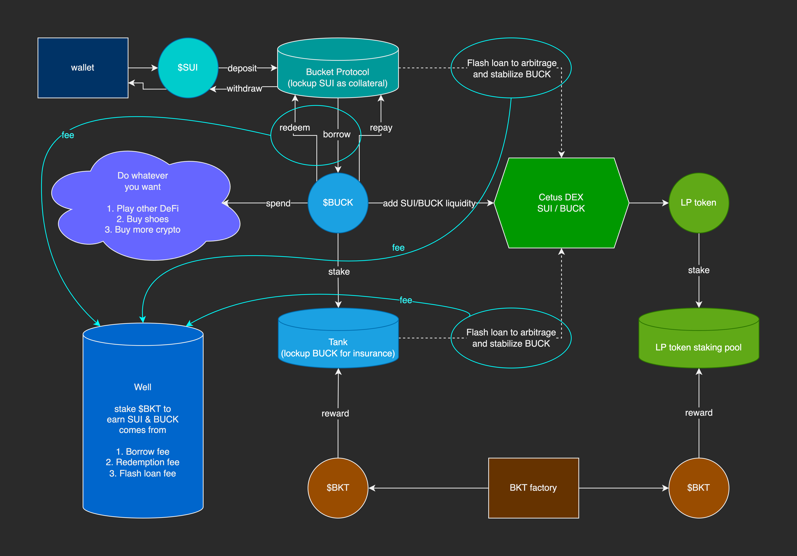

# Bucket Protocl: 0% interest lending protocol native to Sui Network.

## Basic Information

### Project Name or Logo

Bucket Protocol

    

### Project Website

https://app.bucketprotocol.io

### Primary Contact

Primary Contact
Email: gregshen0925@pm.me
Twitter: https://twitter.com/bucket_protocol
TG: [@Greg_Shen](https://t.me/gregshen0925)

### GitHub Repository (Optional)

[https://github.com/Bucket-Protocol](https://github.com/Bucket-Protocol)

## Project Description

Bucket Protocol is a non-custodial, 0% interest lending protocol native to Sui Network.
It charges users an issuance fee to take out an interest-free loan in USD stablecoin (BUCK) backed by SUI or other collateral. Loans can be liquidated if they fall below 110% collateral ratio. Liquidations are supported by a "Emergency Tank" of deposited BUCK used to pay back the loan in exchange for excess SUI.

### Key benefits of Bucket Protocol?

1. 0% interest rate — as a borrower, there’s no need to worry about constantly accruing debt
2. Minimum collateral ratio of 110% — more efficient usage of deposited Sui
3. Directly redeemable — BUCK can be redeemed at face value for the underlying collateral at any time

### Design of Bucket Protocol

    

## Eligibility

- Is this project deployed on Sui Devnet or Testnet or otherwise integrated with Sui?
  - [x] Yes
  - [ ] No
- Will, at least, one of your team members be able to present your team project in-person at the Sui Demo Day @ HK on April 16th, 2023?
  - [x] Yes
  - [ ] No
