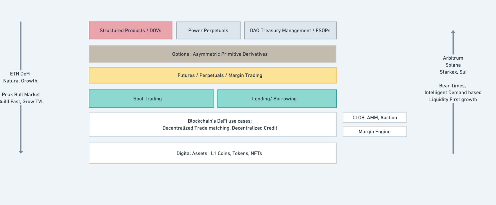

### Project Name or Logo

KriyaDEX (built by Efficacy Labs)

 

### Project Website

[https://efficacy.finance/kriya-sui-dex/](https://efficacy.finance/kriya-sui-dex/)

 

### Primary Contact

Email : aditya@efficacy.finance / adityadw@gmail.com

Telegram : @dwivedij1

Twitter : [https://twitter.com/KriyaDEX](https://twitter.com/KriyaDEX)

 

### GitHub Repository (Optional)

[https://github.com/efficacy-finance/kriya-perp-audit/tree/main](https://github.com/efficacy-finance/kriya-perp-audit/tree/main)

 

## Project Description

### What is Kriya?

Kriya is a DeFi project focused on building sophisticated infra for trading derivatives on-chain. The core problems we aim to solve via our products are:

- Capital Inefficiency
- Inaccurate Price Discovery
- Fragmented Liquidity
- Disproportionate Custodian Risk

We’ve built 2 products so far:

- **KriyaDEX** is an orderbook based DEX for trading perpetuals with 20x leverage and minimal latency (**achieved TPS ~100 on devnet, [package](https://suiscan.xyz/devnet/object/0xd8182f2f10e0163b780026149d89e5cd134327d4) in top 10 by #txns**)
- **KriyaSwap** is an AMM for spot trading (**Used by 10k wallets on devnet**)

 

### Our Vision

<aside>
💪 Our vision is simple yet very focused : Be as good as BitMex/Binance but on-chain

</aside>

- Grossly improve DeFi Derivatives UX, multiple order types, multiple product types
- Aggregate liquidity : Orderbook LPing just like AMMs, Basis Yield Vaults
- Integrate with UNIDEX-like perp aggregators in-app to bring cross-chain liquidity
- Release options DEX if the market permits (on the same OB or a single-writer auction infra)
- See if our OB tech is good enough to be outsourced across Sui protocols (could be Sui SERUM) / Make it faster with ZK proofs somehow
- Using perp and options DEX as backend, build advisory vaults (mostly not for retail but DAO treasuries, concentration risk with own token is an open problem)
- Cross-chain margin account (like a superior gearbox)

 

### Important Links

Landing Page : [https://efficacy.finance/kriya-sui-dex/](https://efficacy.finance/kriya-sui-dex/)

Perp DEX : [https://perp.kriya.finance/dashboard](https://perp.kriya.finance/dashboard)

Spot DEX : [https://www.spot.kriya.finance/](https://www.spot.kriya.finance/)

Blog : [https://kriyadex.substack.com/](https://kriyadex.substack.com/)

Twitter : [https://twitter.com/KriyaDEX](https://twitter.com/KriyaDEX)

Discord : [https://discord.gg/3K24T7MKJD](https://discord.gg/3K24T7MKJD)

 

## Eligibility

- Is this project deployed on Sui Devnet or Testnet or otherwise integrated with Sui?
  - [x] Yes
  - [ ] No
- Will, at least, one of your team members be able to present your team project in-person at the Sui Demo Day @ HK on April 16th, 2023?
  - [x] Yes
  - [ ] No
