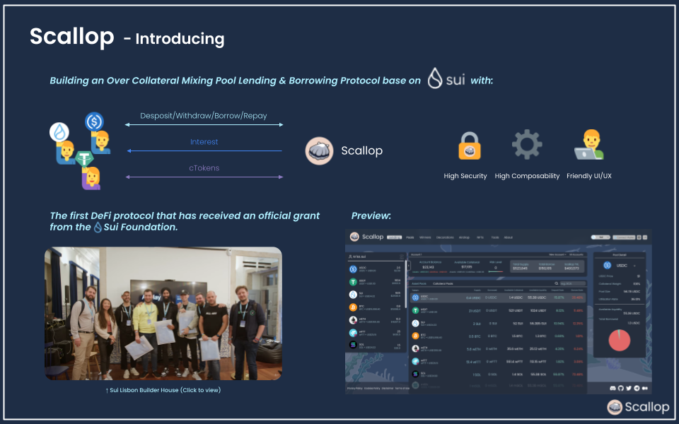

# Scallop: The next-generation interest rate machine for Sui.

## Basic Information

### Project Name or Logo

Scallop

    

### Project Website

https://scallop.io/

### Primary Contact

Primary Contact
Email: team@scallop.io
Twitter: https://twitter.com/Scallop_io
TG:  [@djkrisssssss](https://t.me/djkrisssssss) or [@lyxannn](https://t.me/lyxannn)

### GitHub Repository (Optional)

https://github.com/scallop-io

## Project Description
Scallop is the next-generation interest rate machine for the Sui ecosystem, a protocol with emphasizes a user-friendliness money market with high-interest lending, low-fee borrowing, and premium bonds.

## Introducing

    

## Demo

## Eligibility

- Is this project deployed on Sui Devnet or Testnet or otherwise integrated with Sui?
  - [ ] Yes
  - [x] No
- Will, at least, one of your team members be able to present your team project in-person at the Sui Demo Day @ HK on April 16th, 2023?
  - [x] Yes
  - [ ] No
