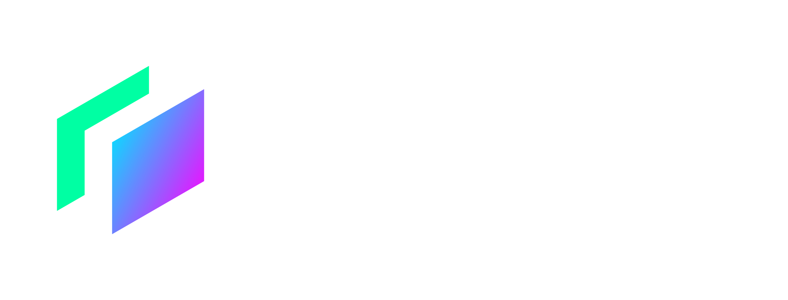

# Releap

## Basic Information

### Project Name or Logo

### Project Website

https://releap.xyz

### Primary Contact

Email: aaron@releap.io
Twitter: https://twitter.com/releap_io

## Project Description

Releap - Decentralized social network for the next billion users on Sui

### Core Features:

User profiles: Users maintain full control of their own profile and their followers

Creator-owned content: Creators retain ownership and control over their own work and profile, and how it is shared and distributed on the network

Built-in monetization: Creators on Releap can restrict access to content based on membership, one-off payment or other conditions

Censorship resistant: No central point of control that can be targeted by a government or other entity seeking to censor or manipulate content on the platform

## Eligibility

- Is this project deployed on Sui Devnet or Testnet or otherwise integrated with Sui?

  - [x] Yes
  - [ ] No

- Will, at least, one of your team members be able to present your team project in-person at the Sui Demo Day @ HK on April 16th, 2023?
  - [x] Yes
  - [ ] No
