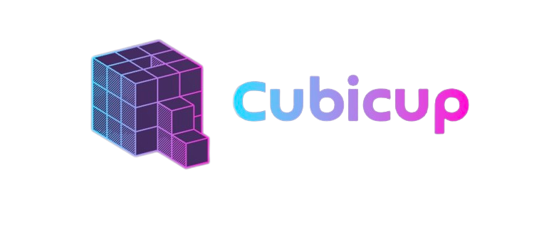

# Cubicup - Web3 Gaming Toolset on Sui

## Basic Information

### Project Name or Logo

**Cubicup**

### Project Website

[cubicup.io](https://www.cubicup.io/)

### Primary Contact

**Email:** contact@cubicup.org alex@cubicup.org

**Telegram:** https://t.me/cubicupofficial

**Twitter:** https://twitter.com/cubicupofficial

### GitHub Repository (Optional)

[GitHub Repository](https://github.com/CubicupDAO)

## Project Description 

Cubicup is a gaming toolset on Sui, onboarding millions of users and game studios to the Web3 gaming era.

Cubicup is a comprehensive platform designed to offer a user-friendly experience for users and to simplify the game development process for studios. Cubicup offers convenient login experience, multiple payment channels and a unified economic model to level up in the Cubicup ecosystem and earn rewards across multiple games. The platform also features the Sui game sdk and a range of other tools and functionalities, including AI empowerment toolsets, digital asset exchange and user growth support. 

## Eligibility

- Is this project deployed on Sui Devnet or Testnet or otherwise integrated with Sui?
    - [x] Yes
    - [ ] No
- Will, at least, one of your team members be able to present your team project in-person at the Sui Demo Day @ HK on April 16th, 2023?
    - [x] Yes
    - [ ] No