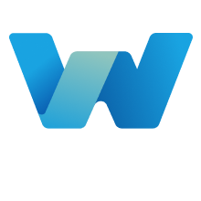

## Basic Information

### Project Name and Logo

Walless, the first web3 sandbox-wallet

### Project Website

[walless.io](https://walless.io/)

### Primary Contact

**Email:** hello@walless.io, zang@stormgate.io 

**Telegram:** https://t.me/walless_wallet

**Twitter:** https://twitter.com/walless_wallet

### GitHub Repository (Optional)

[Project Repository](https://github.com/cocrafts/walless), [Organization space](https://github.com/walless-labs)

## Project Description

Walless is the first web3 sandbox-wallet with embedded dApps, simplified onboarding, unified cross-chain interface.

Walless is a comprehensive and innovative web3 wallet solution that caters to both end-users and developers. Our non-custodial wallet simplifies onboarding with social account logins and offers a user-centric unified layout for a seamless experience for new web3 users. Additionally, our embedded dApp sandbox allows for endless possibilities for building on our platform and enables web2 apps to onboard to the world of web3. With this approach, Walless has the potential to revolutionize the way we think about crypto wallets.

With that in mind, we're [open source](https://github.com/cocrafts/walless) from day one!

## Eligibility

- Is this project deployed on Sui Devnet or Testnet or otherwise integrated with Sui?
    - [x] Yes
    - [ ] No
- Will, at least, one of your team members be able to present your team project in-person at the Sui Demo Day @ HK on April 16th, 2023?
    - [x] Yes
    - [ ] No
